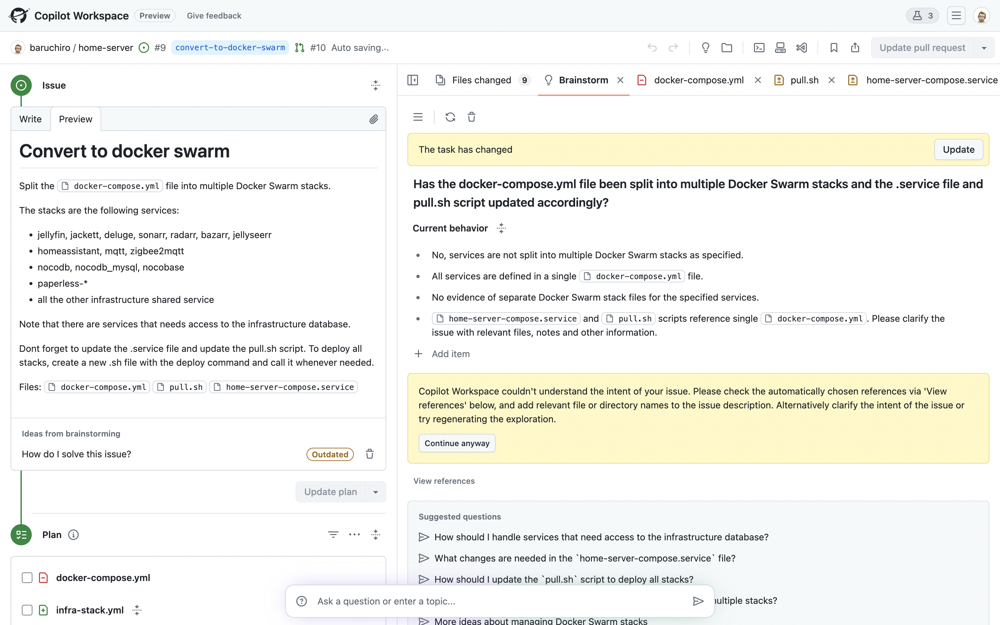
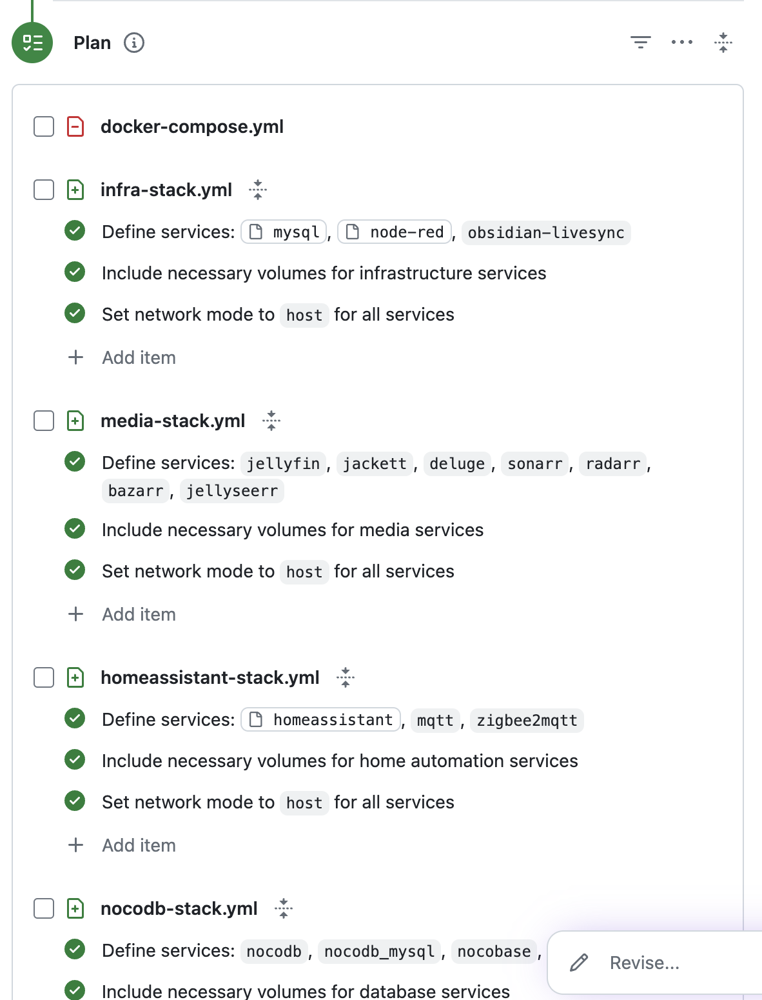
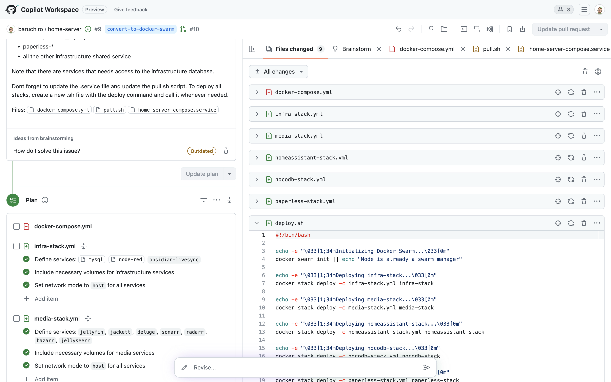
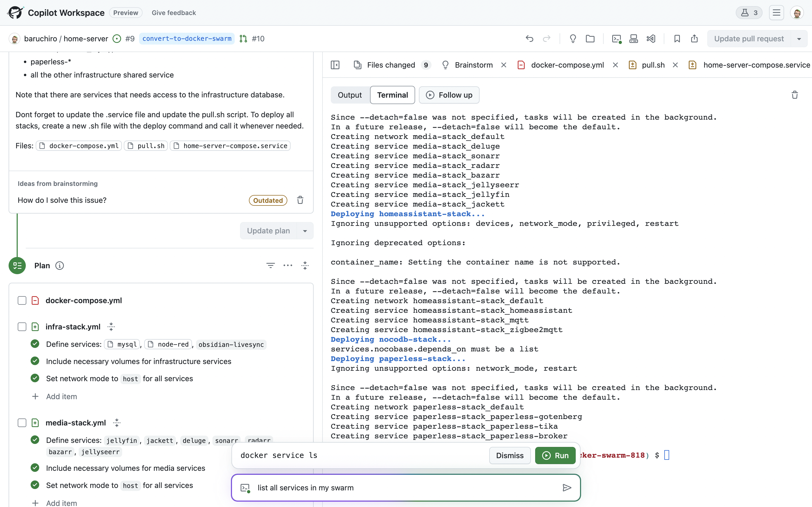

אני לא בקיא ועוקב אחרי כל כלי הAI שיוצאים כל רגע. יש לי מנוי לCopilot (שהחברה משלמת), מידי פעם אני פותח Chat GPT, וזהו, מספיק לי.

אבל אני לא מצליח לעמוד בעומס של בקשות קוד שמחכות לי בפרויקטים של קוד פתוח, או תיקונים קטנים לפרויקטים האלה או לפרויקטים אישיים וביתיים. אז לפני כמה ימים חשבתי על זה ואמרתי שחייב להיות פתרון לזה.

נזכרתי בסטארטאפ ישראלי שניסיתי כשהוא רק התחיל, ואמרתי שניתן עוד צ׳אנס, אבל אז נזכרתי בפיצ׳ר הנסיוני החדש הזה של GitHub והוא כנראה מתאים הרבה יותר.

## התחלה

העבודה מתחילה עם כתיבת Issue בגיטאהב, ומשם בלחיצת כפתור עוברים לעבודה של הAI על מה שכתבנו, בתוך הסביבה של Copilot Workspace.

וכאן אני מגיע לעיקר. אנחנו רגילים לעבודה עם AI בזמן האחרון בממשק צ'אט, כי באמת ככה הוא עובד. מצד שני, הבעיה הגדולה שלי עם משימות מורכבות בAI היא שאני אף פעם לא כותב לו בדיוק את מה שהוא צריך, ואז הוא עושה לי עבודה מלאה, ואז אני אומר לו "בעצם לא" וכו'.

אז מה שמצאתי פה, ואני חושב שזה ייחודי, זאת היכולת לתקשר ולוודא אותו בכל שלב. והנה איך שזה עובד:

## שלב ראשון - סיעור מוחות

אחרי שכתבתי תיאור כלשהו של הבעיה, הAI מתאר לי את מה שהוא הבין, את המצב הנוכחי של הפרויקט, ואת מה שצריך לבצע. בשפה טבעית.
אני עובר על זה וכשאני רואה שהוא לא הבין משהו כמו שצריך, אני מתקן את תיאור המשימה, מרחיב, מוסיף פרטים ואומר לו לחשוב שוב. 
(לצערי, משום מה התיאור נהיה מפורט יותר, אבל הissue שיצאתי ממנו לא מתעדכן בהתאם. אבל לא נורא, המידע לא נעלם כפי שנראה בהמשך)

אני מצפה בסוף השלב הזה לתיאור מדויק של המשימה שאני כבר יודע שהAI יידע מה לעשות איתו. אני לא צריך לנחש מראש איזה פרטים לכלול, איזה פורמט, כמה לרדת לפרטים ובעצם לעבוד בכתיבת מסמכי דרישות.

## שלב שני - תכנית עבודה

אחרי שהתיאור מוכן, אני אומר לAI ליצור את תוכנית העבודה, ואני מקבל רשימה לפי קבצים, של כל הפעולות שהוא מתכנן לעשות.

קודם כל זאת הזדמנות לוודא שוב שהוא לא בורח לי לכיוונים לא רלוונטיים. אני מסתכל על התוכנית שלו, אני יכול לערוך אותה גם כן, להוסיף לו משימות, לערוך משימות קיימות, להוסיף פעולות על קבצים נוספים וכו׳. ממש נקודת עצירה והתאמה שוב פעם.

## שלב שלישי - ביצוע

הכל נראה נכון- אפשר לתת לו לעבוד. הוא יעבור אחד אחד על הקבצים והמשימות ויבצע אותן, כשהוא מסמן כל משימה שהוא ביצע.

ממש באותו ממשק אני יכול לראות את התוצאות, את הdiff שנוצר ולבדוק אותו בזמן אמת:

## תיקונים

אחרי שאני רואה את הביצוע, אני יכול לראות שלמרות הכל שכחנו משהו (שנינו). בשלב הזה אני שוב יכול לעדכן את תיאור המשימה ולהגיד לו לעדכן את התוכנית או את הקוד. אני יכול לעדכן בעצמי את התוכנית והוא יידע לזהות איזה משימות שיניתי או הוספתי ולבצע אותן שוב.

אני יכול ככל הנראה לפתוח PR, מה שבעצם אומר שעשיתי commit, ואז להמשיך את התיקונים שלי שלב על גבי שלב.

יש כמובן את מה שרואים בתמונות, את מנגנון השיחה ״revise״.

## כלים נוספים

בדוגמא שרואים פה, אני מנסה לעבוד עם מנגנונים של Docker. אז אולי לא ציפיתם, אבל באותו ממשק ממש, אני יכול לבדוק את השינוי בפועל!

בזכות פיצ׳ר אחר של GitHub שנקרא Codespaces, יש לנו ממש סביבות פיתוח בענן. אז כשאני לוחץ על Terminal, נפתחת לי סביבת פיתוח ויש לי גישה לטרמינל, שם אני יכול להריץ את הפרויקט שלי ולבדוק אם הוא עולה כמו שצריך.

אני כבר לא זוכר איך עובדים עם swarm (ואולי בכלל אעבור לk8s), אז יש לי את הצ׳אט הבסיסי שמאפשר לי לקבל עזרה בכתיבת פקודות.

זהו, יש פה עוד כמה כלים, ובסוף העבודה אני פותח PR והוא מפרט את כל מה שיצרנו פה ביחד, יחד עם הקוד כמובן.

מה צריך יותר מזה?